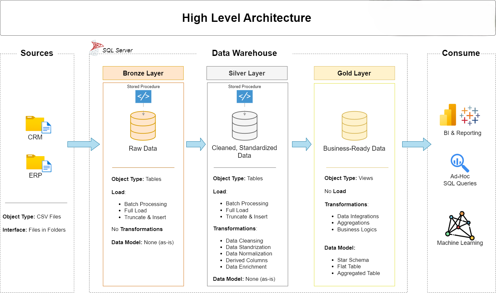
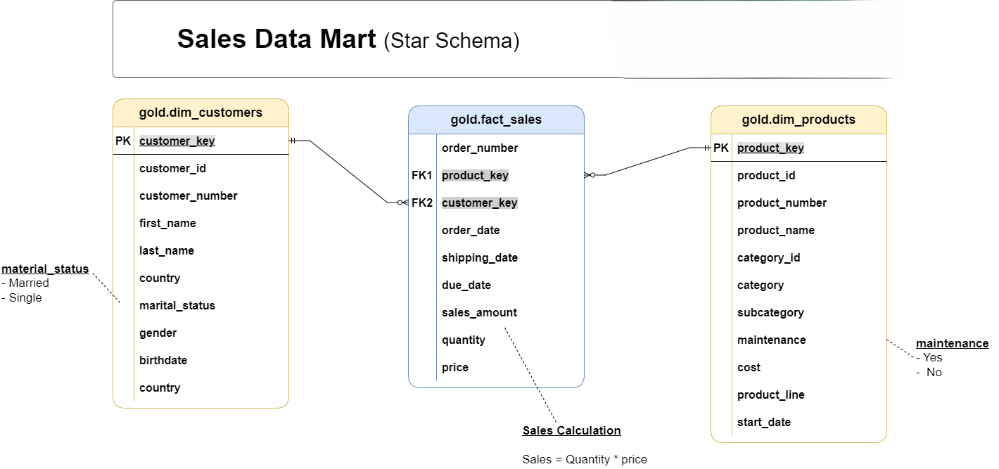

# Data Warehouse and Analytics Project

## Overview

This repository contains a comprehensive **Modern Data Warehouse** solution built on the **Medallion Architecture** pattern. The project demonstrates industry best practices for data engineering, including ETL pipeline development, data integration, and analytical modeling using SQL Server.

---

## 🏗️ Project Architecture

The solution implements a three-layer medallion architecture for progressive data transformation and quality improvement:

### Architecture Layers

  
  


#### **Bronze Layer** - Raw Data Ingestion
- Stores raw, unprocessed data extracted directly from source systems
- Minimal transformations; data is loaded as-is from CSV files
- Source systems: ERP and CRM platforms
- Tables created from source data without modification
- Foundation for downstream transformation processes


#### **Silver Layer** - Data Cleansing & Standardization
- Applies business rules and data quality standards
- Performs data cleansing, validation, and deduplication
- Normalizes data formats and resolves inconsistencies
- Prepares trusted, quality-assured data for analysis
- Intermediate layer for validated data operations


#### **Gold Layer** - Analytical Data Mart
- Business-ready data modeled for analytics and reporting
- Implements star schema design with fact and dimension tables
- Optimized for BI tools and analytical queries
- Supports decision-making and strategic insights
- Final layer for end-user access and reporting


---

## 📋 Project Objectives

### Data Engineering
Develop a scalable, production-ready data warehouse that:
- Integrates multiple data sources (ERP and CRM systems)
- Ensures data quality through multi-layer validation
- Consolidates disparate systems into a unified analytics platform
- Maintains clear data lineage and governance

### Analytics & Business Intelligence
Deliver actionable insights across:
- **Customer Analytics**: Customer segmentation, behavior analysis, lifetime value
- **Product Performance**: Sales by product, category trends, performance metrics
- **Sales Intelligence**: Revenue trends, sales pipeline analysis, performance dashboards

---

## 📂 Repository Structure

```
Data-warehouse-project/
│
├── datasets/                           # Raw source datasets from source systems
│   ├── source_crm/                     # CRM system exports (CSV format)
│   │   ├── cust_info.csv               # Customer information
│   │   ├── prd_info.csv                # Product information
│   │   └── sales_details.csv           # Sales transactions
│   │
│   └── source_erp/                     # ERP system exports (CSV format)
│       ├── CUST_AZ12.csv               # ERP customer data
│       ├── LOC_A101.csv                # ERP location data
│       └── PX_CAT_G1V2.csv             # ERP product category data
│
├── docs/                               # Project documentation and visual assets
│   ├── data_layers-1.png               # Architecture diagram - Layers overview
│   ├── data_layers-2.png               # Architecture diagram - Detailed flows
│   ├── data_layers-3.png               # Architecture diagram - Data relationships
│   ├── data_flow.png                   # ETL data flow diagram
│  
│
├── scripts/                            # SQL transformation and ETL scripts
│   ├── bronze/                         # Bronze layer: Raw data load
│   │   ├── Create_tables.sql           # DDL: Create all bronze staging tables
│   │   └── Insert.sql                  # DML: Load CSV data into bronze tables
│   │
│   ├── silver/                         # Silver layer: Data cleansing & transformation
│   │   ├── create.sql                  # DDL: Create silver layer tables
│   │   └── insert.sql                  # DML: Transform and load cleansed data
│   │
│   └── gold/                           # Gold layer: Analytical data models
│       └── gold.sql                    # DDL/DML: Create and populate analytical tables
│
├── backup.sql                          # Database backup and schema definition
├── README.md                           # This file
├── LICENSE                             # Repository license
└── .git/                               # Version control history

```

---

## 🛠️ Technology Stack
- **Database**: MS SQL Server
- **Data Source Format**: CSV files
- **ETL Approach**: SQL-based transformations
- **Architecture Pattern**: Medallion Architecture (Bronze-Silver-Gold)
- **Data Modeling**: Star schema design for analytical layer
- **Version Control**: Git


---

## 🚀 Getting Started

### Prerequisites
- SQL Server 2019 or later
- SQL Server Management Studio (SSMS)
- Access to source CSV datasets

### Setup Instructions

1. **Create Database Schema**
   ```sql
   -- Execute Create_tables.sql in the bronze layer
   scripts/bronze/Create_tables.sql
   ```

2. **Load Bronze Layer Data**
   ```sql
   -- Execute Insert.sql to load raw data
   scripts/bronze/Insert.sql
   ```

3. **Transform to Silver Layer**
   ```sql
   -- Execute silver layer scripts for cleansing and standardization
   scripts/silver/create.sql
   scripts/silver/insert.sql
   ```

4. **Build Gold Layer Analytics**
   ```sql
   -- Execute gold layer scripts for analytical models
   scripts/gold/gold.sql
   ```
---

## 📊 Data Sources

### CRM System
- **cust_info.csv**: Customer demographics and attributes
- **prd_info.csv**: Product catalog and pricing information
- **sales_details.csv**: Transaction-level sales data

### ERP System
- **CUST_AZ12.csv**: Enterprise customer master records
- **LOC_A101.csv**: Location and region information
- **PX_CAT_G1V2.csv**: Product category classifications

---

## 📝 Documentation

Comprehensive documentation is available in the [docs/](docs/) directory, including:
- Architecture diagrams and visual representations
- Data flow diagrams showing ETL processes
- Detailed data model documentation
- Schema relationship diagrams

---

## 📧 Contact & LinkedIn
For questions, feedback, or collaboration opportunities:  
[LinkedIn Profile](https://www.linkedin.com/in/rahulbt/)
