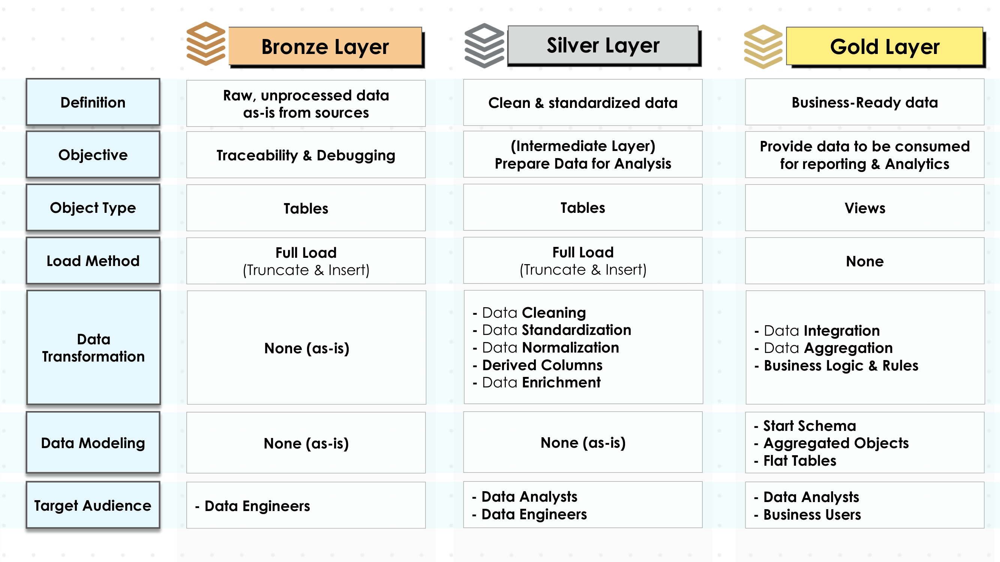
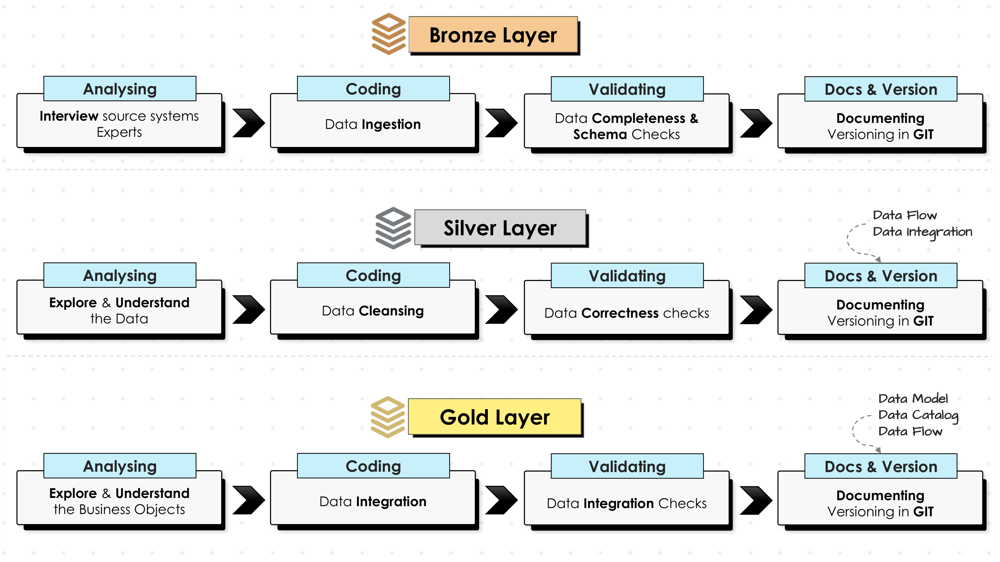
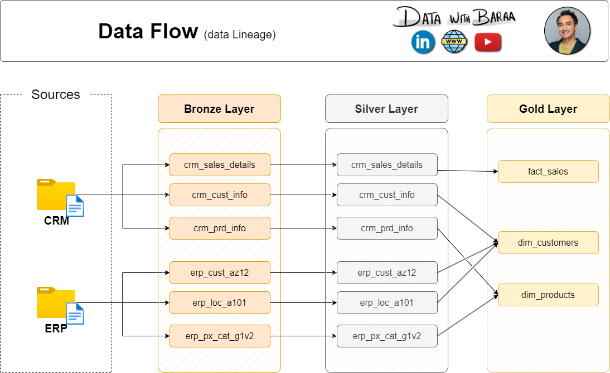

# Data Warehouse and Analytics Project

Welcome to the **Data Warehouse and Analytics Project** repository! 🚀  
This project demonstrates a comprehensive data warehousing and analytics solution, from building a data warehouse to generating actionable insights. Designed as a portfolio project, it highlights industry best practices in data engineering and analytics.

---
## 🏗️ Data Architecture

The data architecture for this project follows Medallion Architecture **Bronze**, **Silver**, and **Gold** layers:





1. **Bronze Layer**: Stores raw data as-is from the source systems. Data is ingested from CSV Files into SQL Server Database.

2. **Silver Layer**: This layer includes data cleansing, standardization, and normalization processes to prepare data for analysis.
3. **Gold Layer**: Houses business-ready data modeled into a star schema required for reporting and analytics.

---
## 📖 Project Overview

This project involves:

1. **Data Architecture**: Designing a Modern Data Warehouse Using Medallion Architecture **Bronze**, **Silver**, and **Gold** layers.
2. **ETL Pipelines**: Extracting, transforming, and loading data from source systems into the warehouse.
3. **Data Modeling**: Developing fact and dimension tables optimized for analytical queries.
4. **Analytics & Reporting**: Creating SQL-based reports and dashboards for actionable insights.


---

## 🚀 Project Requirements

### Building the Data Warehouse (Data Engineering)

#### Objective
Develop a modern data warehouse using SQL Server to consolidate sales data, enabling analytical reporting and informed decision-making.

#### Specifications
- **Data Sources**: Import data from two source systems (ERP and CRM) provided as CSV files.
- **Data Quality**: Cleanse and resolve data quality issues prior to analysis.
- **Integration**: Combine both sources into a single, user-friendly data model designed for analytical queries.
- **Scope**: Focus on the latest dataset only; historization of data is not required.
- **Documentation**: Provide clear documentation of the data model to support both business stakeholders and analytics teams.

---

### BI: Analytics & Reporting (Data Analysis)

#### Objective
Develop SQL-based analytics to deliver detailed insights into:
- **Customer Behavior**
- **Product Performance**
- **Sales Trends**

These insights empower stakeholders with key business metrics, enabling strategic decision-making.  

For more details, refer to [docs/requirements.md](docs/requirements.md).

## 📂 Repository Structure
```
data-warehouse-project/
│
├── datasets/                           # Raw source datasets (CSV files from ERP and CRM systems)
│   ├── source_crm/                     # CRM data source files
│   └── source_erp/                     # ERP data source files
│
├── docs/                               # Project documentation and visual architecture details
│   ├── data_layers-1.png               # Data architecture diagram (page 1)
│   ├── data_layers-2.png               # Data architecture diagram (page 2)
│   ├── data_layers-3.png               # Data architecture diagram (page 3)
│   └── data_flow.png                   # Data flow diagram
│
├── common_scripts/                     # Shared SQL scripts (table creation, common utilities)
│   └── Create_tables.sql               # SQL DDL script to create all bronze layer tables
│
├── scripts/                            # SQL ETL and transformation scripts organized by layer
│   ├── bronze/                         # Bronze layer: Extract and load raw data from sources
│   │   └── Insert.sql                  # Stored procedure: Load CSV data into bronze tables
│   ├── silver/                         # Silver layer: Data cleansing, standardization, normalization
│   └── gold/                           # Gold layer: Business-ready analytical data models
│
├── README.md                           # Project overview, architecture, and setup instructions
├── LICENSE                             # License information for the repository
└── .git/                               # Git version control directory
```
---

## ☕ Stay Connected

Let's stay in touch! Feel free to connect with me on likedIn profile: [LinkedIn](https://www.linkedin.com/in/rahulbt/)
